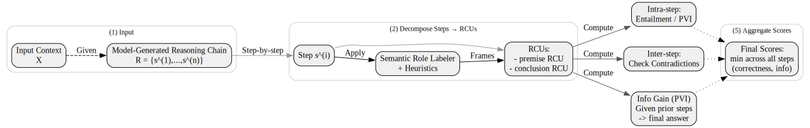
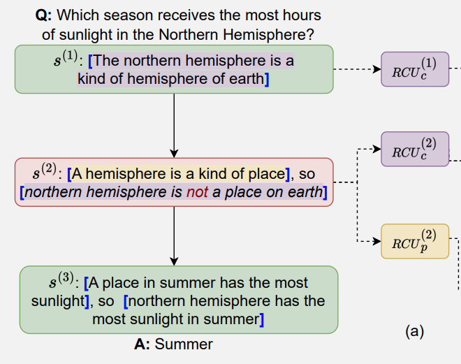
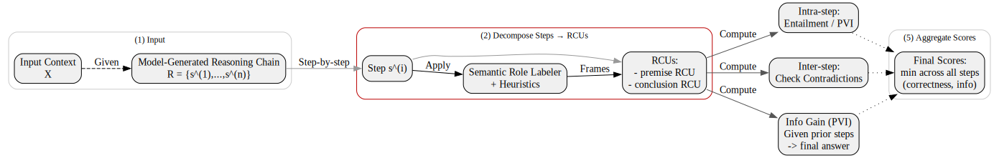
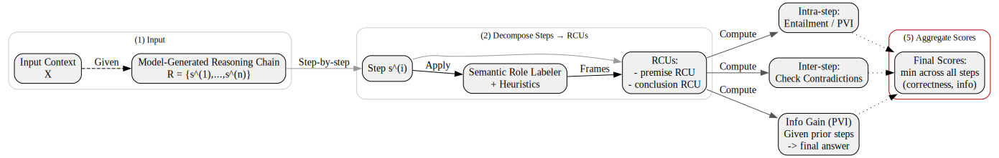
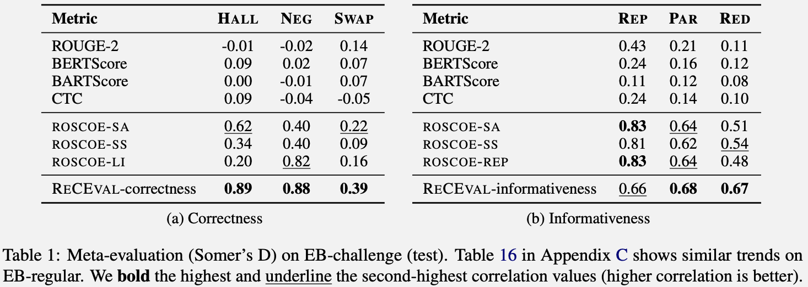
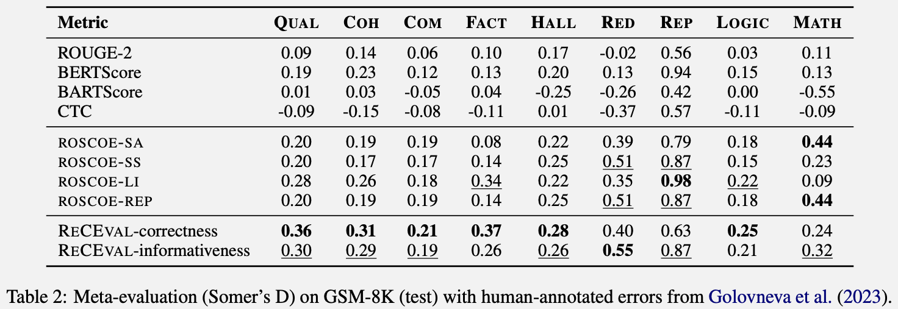
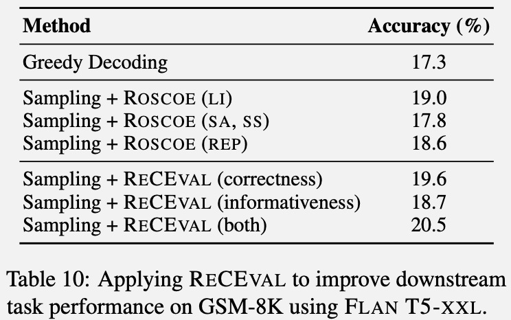

# ReCEval: Evaluating Reasoning Chains via Correctness and Informativeness

Author: Archiki Prasad, Swarnadeep Saha, Xiang Zhou, Mohit Bansal
Conference: EMNLP 2023
URL: <https://aclanthology.org/2023.emnlp-main.622/>
Presenter: Koki Maeda

---

## What does this paper state?

> 😵‍💫 Existing methods focus on only whether the reasoning leads to the correct answer.
> 😵‍💫 They don't really look at **how good the reasoning process itself** is.
> 😵‍💫 Cause shortcuts that give the _right_ answer w/ _poor_ logic.

> **Key Goal**: Evaluate reasoning by analyzing if each step is **correct** and **informative**.

> **Author's Stance**: The authors see reasoning chains as "informal proofs" and want to evaluate them based on if each step is logically sound AND helpful for the final answer.

---

<!-- ## Reasoning Task

Let the **input context** be $X$, and let the **reasoning chain** $R$ be a sequence of $n$ steps:

$$
R = \{ s^{(1)}, s^{(2)}, \ldots, s^{(n)} \}.
$$

Each step $s^{(i)}$ eventually leads to the final (predicted) answer $\hat{a}$. -->

<!-- --- -->

## Motivation: Why previous metrics are not enough? #1

Previous metrics focus on **surface-level similarity** or **likelihood**:

- **N-gram Overlap Metrics** (BLEU, ROUGE)

  - Compare surface-level token overlap with some reference
  - **Issue**: Don't capture multi-step logic, can't detect contradictions

- **Embedding-based Scores** (BERTScore, MoverScore)

  - Measure semantic similarity w.r.t. reference text
  - **Issue**: "logically correct reasoning" $\ne$ "fluent text"

- **Generative Probability Metrics** (BARTScore, CTC)

  - Use a pre-trained/fine-tuned LM to assess fluency/likelihood
  - **Issue**: May favor well-formed text but overlook stepwise correctness or new info

---

## Motivation: Why previous metrics are not enough? #2

- **Existing Reasoning Metrics** (ROSCOE, etc.)
  - Partially address chain-of-thought evaluations
  - **Limitations**: Often rely on textual similarity or partial checks—may miss fine-grained step correctness or “helpfulness” (informativeness)

> **ReCEval** specifically focuses on:
>
> 1. **Correctness** (both local and global consistency)
> 2. **Informativeness** (detects redundancy vs. genuine contribution)

---

## The Proposed Framework: ReCEval

- **Reasoning Chain:** A sequence of multi-step rationales that lead to a final answer.
  - $R = \{ s^{(1)}, s^{(2)}, \ldots, s^{(n)} \}$, Step $s^{(i)}$ eventually leads to the final (predicted) answer $\hat{a}$.
- **Step Decomposition:** Each step $s^{(i)}$ is broken down into smaller units.
- **Two Core Dimensions**:
  1. **Correctness**: Are intermediate conclusions valid and consistent with previous steps/context?
  2. **Informativeness**: Does each step add meaningful new information that helps derive the final answer?

---

## Step Decomposition: RCUs

We decompose each step $s^{(i)}$ into smaller units: **Reasoning Content Units (RCUs)**.

- **Premise RCUs**: Supporting facts or assumptions within that step.
  - $\{ \mathrm{RCU}^{(i)}_{p_j} \}$ for $j = 1, \ldots, t$
- **Conclusion RCU**: The key inference or statement that the step arrives at. : $\mathrm{RCU}^{(i)}_{c}$

A step $s^{(i)}$ can be seen as a sequence of RCUs:

$$
s^{(i)} = \Bigl\{ \mathrm{RCU}^{(i)}_{p_1}, \ldots, \mathrm{RCU}^{(i)}_{p_t},\; \mathrm{RCU}^{(i)}_{c} \Bigr\}.
$$

> **Why?**: Fine-grained analysis: Evaluate each conclusion precisely against the premises.
> **How?**: **SRL model\*** decomposes a sentence into **‘subject-verb-object’ frames**.

---

## Example Step

 SRL model decomposes a sentence with [] brackets.

Then we compute the correctness / informativeness of each RCU:smile:

---

## Correctness Evaluation, at two aspects

- **Intra-step** correctness:
  - Checks if the conclusion RCU is logically entailed by the premise RCUs.
  - Uses **NLI (Natural Language Inference)** or **PVI (pointwise V-information)** to score entailment.
- **Inter-step** correctness:
  - Ensures each conclusion does **not** contradict prior conclusions or the original input.
  - Uses an **NLI-based approach to detect contradictions** across steps.

---

## Intra-step Correctness: How to Measure?

**Entailment-based** approach checks if the conclusion RCU is entailed by the premise RCUs. Formally:

$$
\text{intra-correct}_{\text{entail}}^{(i)}
\;=\;
P_{\mathrm{entail}}\!\Bigl(\;\mathrm{RCU}_{p}^{(i)};\,\mathrm{RCU}_{c}^{(i)}\Bigr),
$$

where $P_{\mathrm{entail}}$ is the probability that $\mathrm{RCU}_{c}^{(i)}$ is entailed by the concatenated premises $\mathrm{RCU}_{p}^{(i)}$.

**PVI-based** approach uses pointwise V-information:

$$
\text{intra-correct}_{\text{PVI}}^{(i)}
\;=\;
\mathrm{PVI}\!\ \Bigl(\mathrm{RCU}_{p}^{(i)} \;\to\; \mathrm{RCU}_{c}^{(i)}\Bigr).
$$

Here, $\mathrm{PVI}(x \to y)$ measures how much information $x$ provides to generate $y$ under a model family $V$.

---

## Inter-step Correctness

We also require that the conclusion in step $i$ not contradict any previous information (the input $X$ or previous conclusions). Specifically:

$$
\text{inter-correct}^{(i)}
=
1 \;-\; \max_{\,r \,\in\, X \;\cup\; \{\mathrm{RCU}_{c}^{(j)}\}_{j < i}; \leftarrow\mathrm{Former Input} }
\,P_{\mathrm{contr}}\!\bigl(r;\,\mathrm{RCU}_{c}^{(i)}\bigr),
$$

where $P_{\mathrm{contr}}(r; \mathrm{RCU}_{c}^{(i)})$ is the probability of contradiction between $r$ and $\mathrm{RCU}_{c}^{(i)}$.

> **Note**: Authors use a similar NLI-based approach to detect contradictions.

---

## Informativeness Evaluation

> **Key Question**: Does this step reduce uncertainty about the final answer?

- Uses **V-information / PVI** : Higher difference ⇒ more informative.

Measure whether adding step $s^{(i)}$ actually helps move closer to the final answer $\hat{a}$. Using conditional PVI:

$$
\text{info-gain}_{\mathrm{PVI}}^{(i)}
=
\mathrm{PVI}\!\ \Bigl(\,s^{(i)} \;\to\; \hat{a} \;\bigm|\; s^{(<i)}\Bigr).
$$

Intuitively, it compares the likelihood of generating $\hat{a}$ **with** step $s^{(i)}$ included v.s. **without** it.

---

## Putting It All Together

- **ReCEval** runs through each step, computes:
  - $\text{score}_{\mathrm{intra}} \;=\; \min_{\,1 \,\le i \,\le n\,}\bigl\{\text{intra-correct}^{(i)}\bigr\},$
  - $\text{score}_{\mathrm{inter}} \;=\; \min_{\,1 \,\le i \,\le n\,}\bigl\{\text{inter-correct}^{(i)}\bigr\}$
  - $\text{score}_{\mathrm{info}} \;=\; \min_{\,1 \,\le i \,\le n\,}\bigl\{\text{info-gain}^{(i)}\bigr\}.$
- Chain-level scores: **minimum** of all **minimized** steps’ scores

**Outcome**: A single final correctness score + a single final informativeness score.

---

## Experiments #1 Can ReCEval Be Used for Evaluation?

> **Goal**: Meta-evaluate ReCEval against existing metrics and compare its correlation with human judgments.

| Dataset Name    | Domain             | Input / Output                      |
| :-------------- | :----------------- | :---------------------------------- |
| Entailment Bank | Science QA         | Perbutated egations, hallucinations |
| GSM-8K          | Math Word Problems | Human-annotated error categories    |
| DROP            | Discrete Reasoning | Paragraphs to answers               |

- **Baselines**: ROUGE, BERTScore, ROSCOE
- **Metrics**: Somer’s D (correlation with human judgments)

---

## Results: **Higher Sensitivity to Errors**

Detected logic/hallucination mistakes better than typical similarity metrics (ROUGE, BERTScore, etc.) or older reasoning metrics (ROSCOE).

---

## Results: **Better Correlation with Human Judgments**

Strong performance across multiple error types (factuality, redundancy, logic).

---

## Experiments #2 Can ReCEval Improve Downstream Tasks?

> **Goal**: Evaluate if selecting chains with higher ReCEval scores leads to improved final accuracy in tasks like math word problem solving.

**Setup**:

- **Task**: GSM-8K (math word problems)
- **Model**: LM (e.g., FLAN T5-XXL) with multiple candidate chains-of-thought (CoT).
- **Selection**: Compare different chain selection strategies:
  - Baseline: **Greedy** / **Random**
  - Ours: **ReCEval**-guided (rank by correctness + informativeness, pick top)

🤔 If ReCEval can help select better chains, we should see higher final answer accuracy.

---

## Results: **Downstream Gains** 👍

Chain sampling based on ReCEval scores improved final accuracy in math word problems.

---

## Key Findings

1. **Higher Sensitivity to Errors**
   - RECEVAL detects subtle logic/hallucination mistakes better than typical similarity metrics (ROUGE, BERTScore, etc.) or older reasoning metrics (ROSCOE).
2. **Better Correlation with Human Judgments**
   - Strong performance across multiple error types (factuality, redundancy, logic).
3. **Downstream Gains**
   - Selecting chains with higher ReCEval scores leads to improved final accuracy in tasks like math word problem solving.

---

## Takeaways and Future Directions

- **Formalizes “Reasoning Chain Quality”**:
  - Beyond just the final answer → focuses on **stepwise correctness** and **informativeness**.
- **Generalizable to Various Reasoning Tasks**:
  - Science QA, math word problems, discrete reading comprehension, etc.
- **Opens Doors to**:
  - More advanced chain-of-thought evaluation.
  - Automatic selection of the best rationales to boost QA accuracy.
  - Potential synergy with larger LMs (GPT-3.5, etc.) for “self-check” of reasoning.

**In a sentence**: ReCEval is a practical, reference-free way to measure how logical and genuinely useful each step of a model’s reasoning is.

---

<!--
_class: small-list
-->

## Further Related Paper: What's Next? 📚

### Cutting-Edge

GAIR-Lab are publishing a series of papers on reasoning chains (also evaluating them):

- Evaluating Mathematical Reasoning Beyond Accuracy (AAAI 2025, _Oral_ )
- O1 Replication Journey: A Strategic Progress Report -- Part 1

### Multimodal

- M3CoT: A Novel Benchmark for Multi-Domain Multi-step Multi-modal Chain-of-Thought (ACL 2024)
- CoMT: A Novel Benchmark for Chain of Multi-modal Thought on Large Vision-Language Models (AAAI 2025)

### Meta-Reasoning

- MR-GSM8K - A Novel Benchmark for Evaluating Reasoning in LLMs (ICLR 2025 Under Review, 3,6,6,8)

### NeurIPS Papers

- Language Models Don’t Always Say What They Think: Unfaithful Explanations in Chain-of-Thought Prompting (NeurIPS 2023)
- SELF-REFINE: Iterative Refinement with Self-Feedback (NeurIPS 2024)
- Grokked Transformers are Implicit Reasoners: A Mechanistic Journey to the Edge of Generalization (NeurIPS 2024)

---

### Appendix

---

## Meta-Evaluation Metrics: Somer’s D

To measure how well these metrics correlate with _ground truth_ error annotations (e.g., “hallucination” or “redundancy”), the authors use **Somer’s $D$** based on **Kendall’s $\tau$**:

$$
D_{S|E}
=
\frac{\tau(E, S)}{\tau(E, E)},
$$

where

- $E \in \{0,1\}$ indicates whether a given error type is present,
- $S$ is the score assigned by a particular metric.

A higher Somer’s $D$ → better alignment with human judgments of error presence/absence.

---

## Step Decomposition: How to Split Steps into RCUs

1. **Run an SRL model on the step**

   - For a step $s^{(i)}$ (which may be one or more sentences), feed it into an off-the-shelf SRL system (e.g., AllenNLP).
   - The SRL model outputs multiple “frames” in the form of $\text{[ARG0, VERB, ARG1, ...]}$. These are the potential **Reasoning Content Units (RCUs)**.

2. **Remove overlapping frames**

   - If the SRL model returns multiple frames that overlap heavily in text, filter them to keep only the largest or most complete frames.
   - For instance, if one frame is almost entirely contained within a larger one, you would keep the larger one and discard the subset.

---

### Step Decomposition: How to Split Steps into RCUs (cont.)

3. **Identify premise vs. conclusion**

   - Use simple heuristics (or rules) to decide which frames are “premise RCUs” and which frame is the “conclusion RCU.”
   - For example:
     - After **“because”**, **“since”**, or **“due to”** → **premise**.
     - After **“so”**, **“thus”**, or **“hence”**, **conclusion**.
     - If there is no explicit cue word, you can still treat the final statement or main claim as the conclusion, and the rest as premises.

4. **Result**
   - Each step $s^{(i)}$ is split into:
     $$
      s^{(i)} = \{\underbrace{\text{RCU}^{(i)}_{p_1},\,\text{RCU}^{(i)}_{p_2},\,\dots}_{\text{premises}},\;\;\underbrace{\text{RCU}^{(i)}_c}_{\text{conclusion}}\}.
     $$

---

### **Example Step Decomposition**

> “Allen is 12 years old and Bob is 15, so Bob is older.”

1. **SRL Frames** might produce something like:

   - Frames: `(Allen) [is] (12 years old)`, `(Bob) [is] (15)`, `(Bob) [is] (older)`

2. **Heuristic labeling**:
   - **“so”** near the end ⇒ The phrase “Bob is older” is the conclusion.
   - The rest (“Allen is 12 years old and Bob is 15”) forms the premises.

Hence:

- **Premise RCUs**: $\{\text{“Allen is 12 years old”},\;\text{“Bob is 15”}\}$
- **Conclusion RCU**: $\{\text{“Bob is older”}\}$

---

## ROSCOE: A Fine-Grained Scorer for Reasoning Chains

Evaluate multi-step reasoning on **four** dimensions, each in $[0,1]$.

1. **Semantic Alignment (SA)**

   - Measures alignment of hypothesis steps $\{h_i\}$ to source $s$ (and reference $r$).
     $$
     \text{Faithfulness-Step}(h \to s) \;=\; \frac{1}{N}\sum_{i=1}^{N} \mathrm{r\text{-}align}(h_i \to s)
     $$

2. **Semantic Similarity (SS)**
   - Embedding-based measure of how similar the overall chain is to source or reference.
     $$
     \text{Info-Chain}(h \to s) \;=\; \frac{1 + \cos(\mathbf{h}, \mathbf{s})}{2}
     $$
     higher: more semantically aligned at the chain level.

---

### ROSCOE: Logical Inference & Language Coherence (cont.)

3. **Logical Inference (LI)**

   - Uses an NLI model (contradiction probability $p_{\text{contr}}$) to detect logical conflicts:
     $$
     \text{Self-Consistency}(h_i \leftrightarrow h_j)
     \;=\; 1 \;-\;
     \max_{\,i < j} \; p_{\text{contr}}\!\bigl(h_i, h_j\bigr).
     $$
   - Punishes chains with **contradictory steps**.

4. **Language Coherence (LC)**
   - Checks grammar $\bigl(p_{\mathrm{gram}}\bigr)$ and perplexity $\bigl(\mathrm{PPL}\bigr)$.
   - Example:
     $$
     \text{Perplexity-Chain}(h)
     \;=\; \frac{1}{\mathrm{PPL}(h)},
     $$
     inverting PPL to keep scores in $[0, 1]$.

---

### **What’s Good?**

- **Fine-Grained**: Multiple angles (alignment, similarity, logical inference, coherence).
- Can be **Reference-free** or **Reference-based**.
- Intuitive stepwise measures (e.g., alignment vectors per step).

### **What’s Not So Good?**

- SA/SS rely on **embedding similarity** → can be confused by rephrasings or partial logic.
- LI depends on **NLI models** → might miss complex multi-step contradictions.
- LC focuses on **language fluency** → a chain can be grammatically fine but logically wrong.

---

## Does ReCEval "Fix" ROSCOE?

✅ **Yes, Partly**

- **Step-level correctness** (intra-step entailment) addresses a gap in ROSCOE’s alignment-based approach.
- **Information gain** is more direct than “repetition detection” or “semantic coverage,” since it asks _how_ each step reduces uncertainty about the final answer.

:x: **No, Not Completely**

- **ROSCOE** offers a _suite_ of metrics
  - some can detect grammar or coherence issues (LC) that ReCEval does not focus on.
- Large language models used in ReCEval for NLI/PVI can themselves be imperfect.
  - If the chain depends on deeper background knowledge, an NLI model could fail—just as embedding-based approaches sometimes do.
